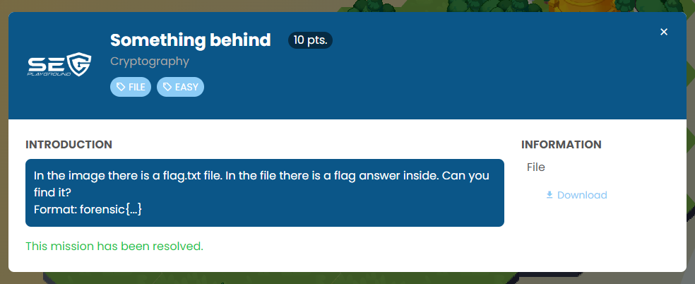
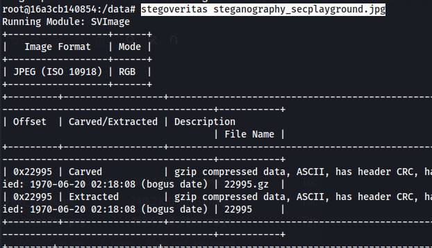
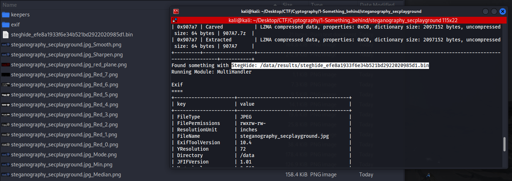
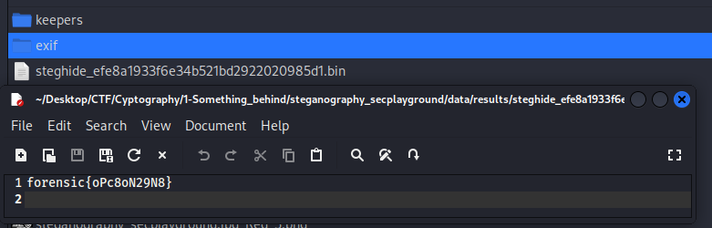

The challenge contains one JPG file.


I'm using this tool to find a hidden file.

https://github.com/DominicBreuker/stego-toolkit

Create a data directory and copy steganography_secplayground.jpg into it. Then use a Docker command to mount and shell into it.

```bash
docker run -v /home/kali/Desktop/CTF/Cyptography/1-Something_behind/steganography_secplayground/data:/data -it dominicbreuker/stego-toolkit /bin/bash
```

Execute the command below to automatically analyze the file.

```bash
stegoveritas steganography_secplayground.jpg
```







