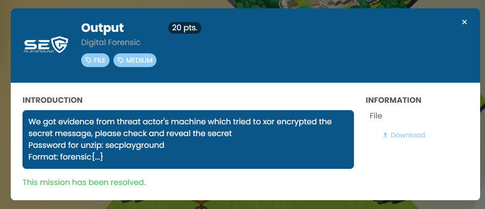
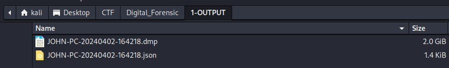
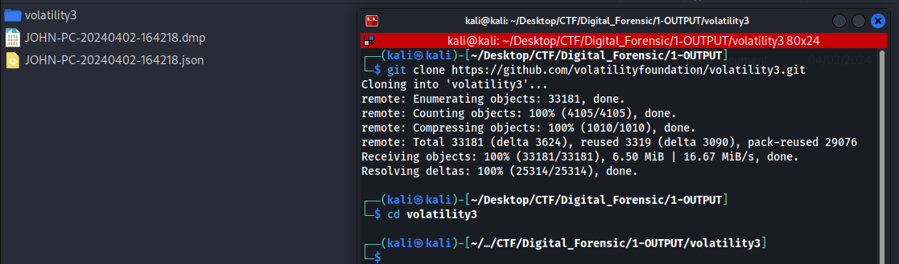
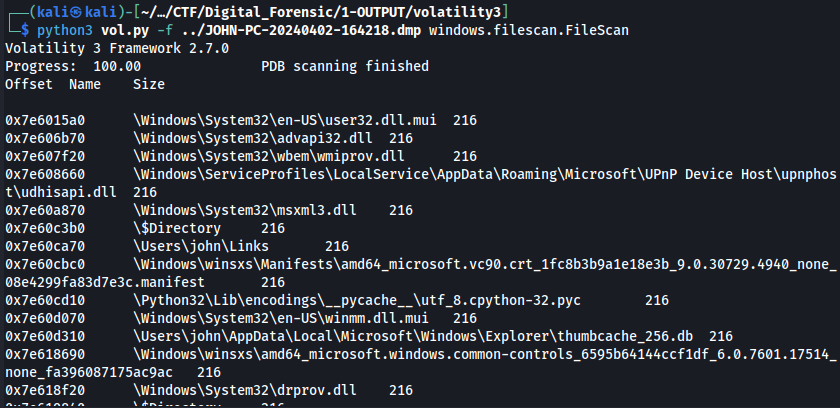
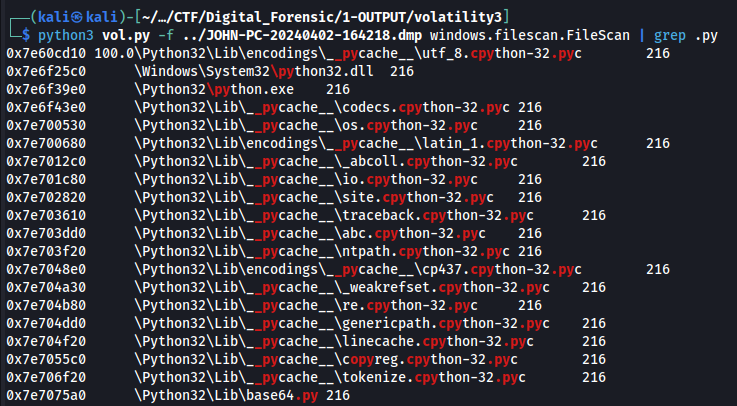
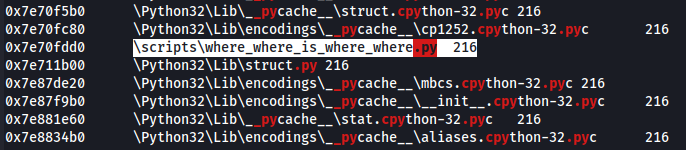
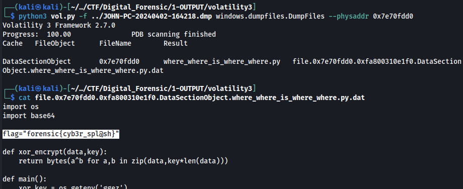

The challenge contains two files. It was a machine memory dump.



I'm using Volatility3 to analyze the memory.

```
git clone https://github.com/volatilityfoundation/volatility3.git
```



I tried to enumerate files and found that the machine has Python installed.

```
python3 vol.py -f ../JOHN-PC-20240402-164218.dmp windows.filescan.FileScan
```



I'm looking for Python source code using the grep command.

```
python3 vol.py -f ../JOHN-PC-20240402-164218.dmp windows.filescan.FileScan | grep .py
```





Now I've found suspicious Python source code. I have to dump it by referencing the physical address on the left side, then use the DumpFiles plugin to extract the file.

```
python3 vol.py -f ../JOHN-PC-20240402-164218.dmp windows.dumpfiles.DumpFiles --physaddr 0x7e70fdd0
```

