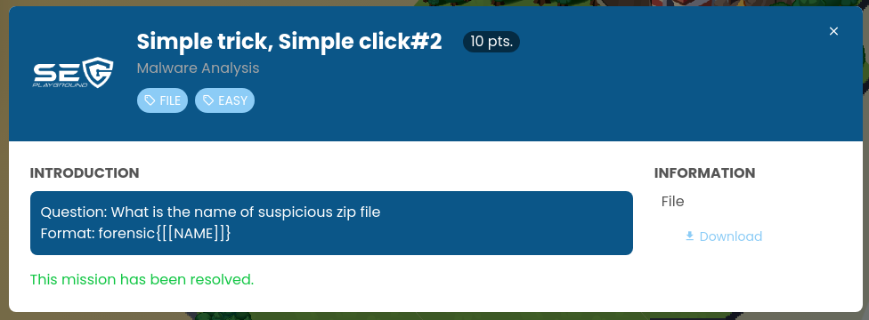
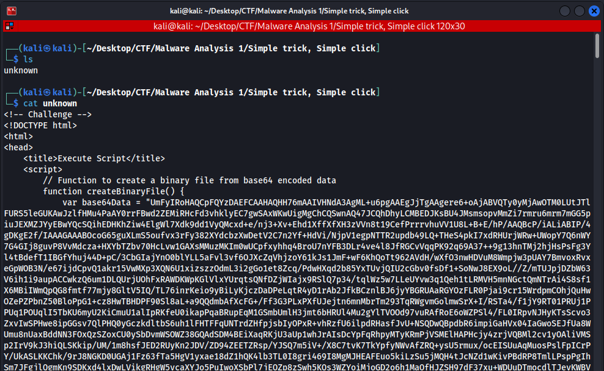
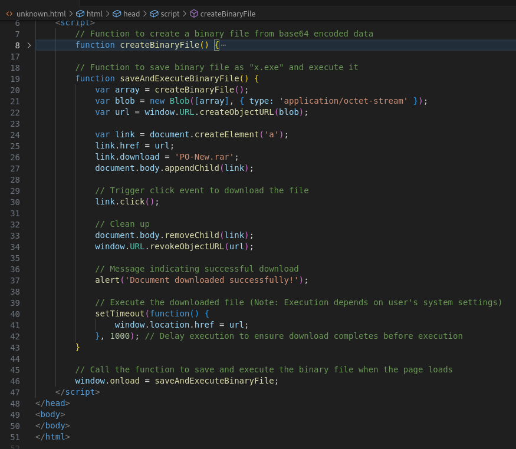
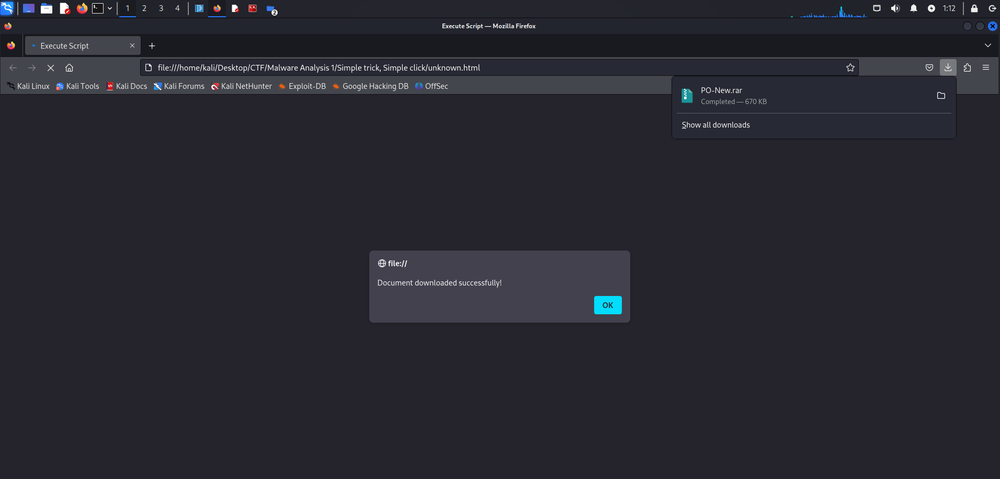
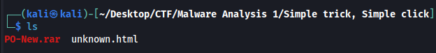

After analyzing the unknown file, I found that it was an HTML file that uses HTML smuggling technique.

HTML smuggling is a technique to bypass corporate file extension policies.

When the victim opens the link, the payload will be reconstructed and automatically downloaded to the disk.

I added the .html extension and opened it with Firefox.

