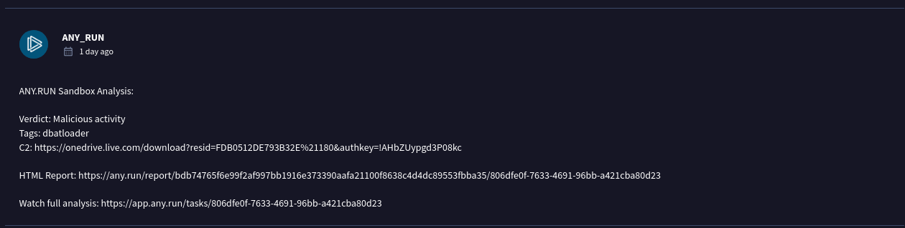

I forgot to screenshot the question. As I remember they want to know which registry key was modify when malware executed.

During my attempt. The flag format seem to be case-sensitive and confusing So I have to ask the staff for clarification of flag format.

To analysis malware ctf, I'm likely to start static analysis with virustotal.


https://www.virustotal.com/gui/file/bdb74765f6e99f2af997bb1916e373390aafa21100f8638c4d4dc89553fbba35

Look into Behavior tab. It's really seem to modify registry. But there too much possible answer. I need to narrow it's down.


So I look for runtime analysis report in community tab. And found a very interesting link.



```
https://app.any.run/tasks/806dfe0f-7633-4691-96bb-a421cba80d23
```


Click on the process 2124. I found that malware will modify the autorun registry.


```
HKEY_CURRENT_USER\SOFTWARE\MICROSOFT\WINDOWS\CURRENTVERSION\RUN
```

But after I tried to submit for flag. It's not valid. After I consult with staff, they informed me that registry key was not in all upper-case.

So I open my windows vm, copy the registry key name and submit.


```
forensic{HKEY_CURRENT_USER\Software\Microsoft\Windows\CurrentVersion\Run}
```

But it's still not valid. So I consult staff again and found that my registry name was valid, but the "software" must be all upper-case like this.

```
forensic{HKEY_CURRENT_USER\SOFTWARE\Microsoft\Windows\CurrentVersion\Run}
```

