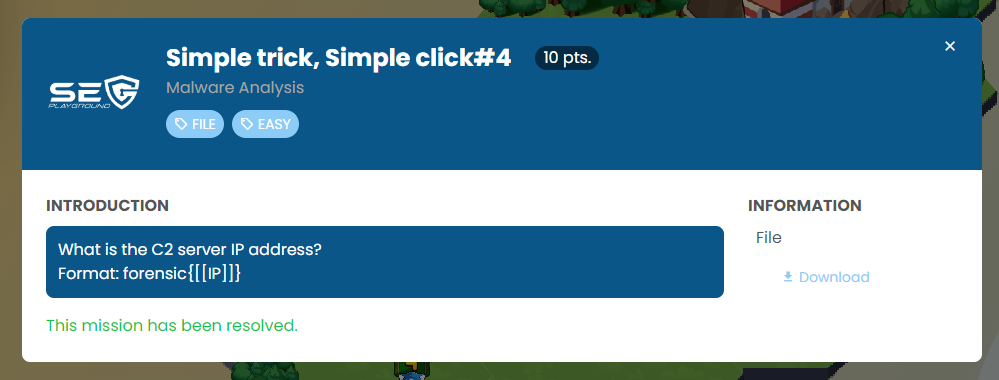
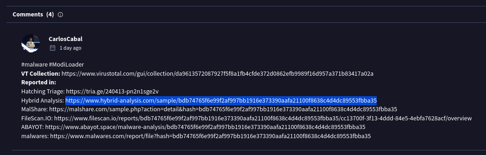
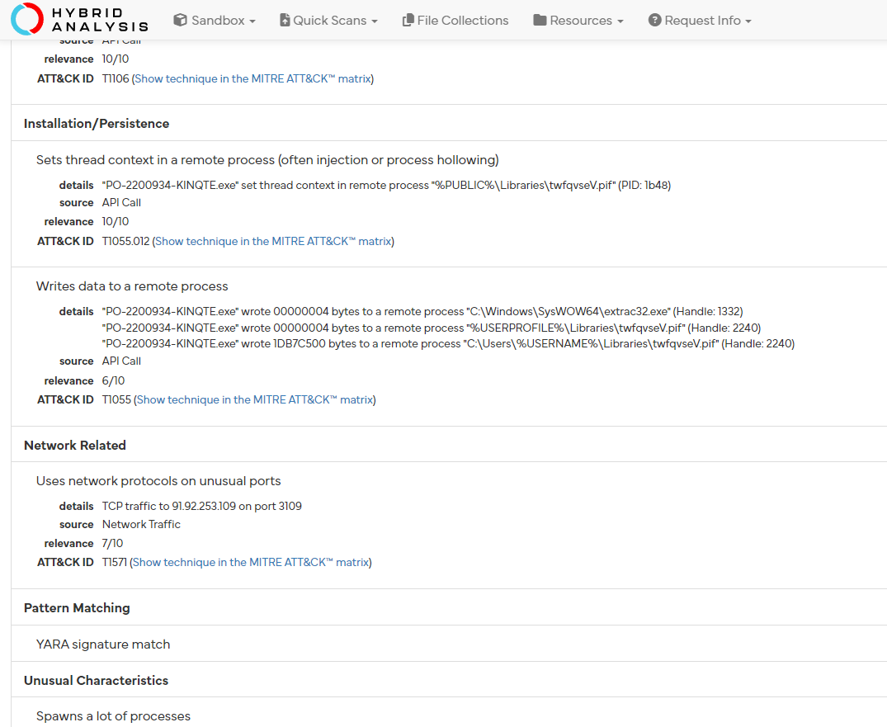

I search throught various link. But It's seem to not a valid C2 server IP address. Because sometime malware will work only in some environment.

Only this link was found a TCP traffic to C2.



```
https://www.hybrid-analysis.com/sample/bdb74765f6e99f2af997bb1916e373390aafa21100f8638c4d4dc89553fbba35/661a3acf6d87e6a1d10d8ea9
```



```
forensic{91.92.253.109}
```

