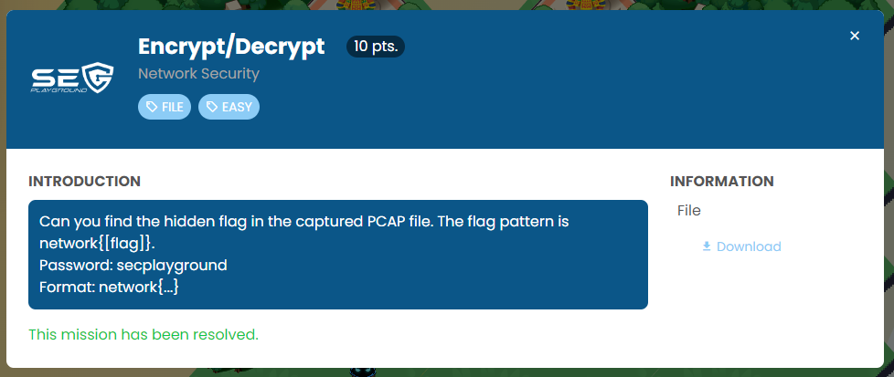
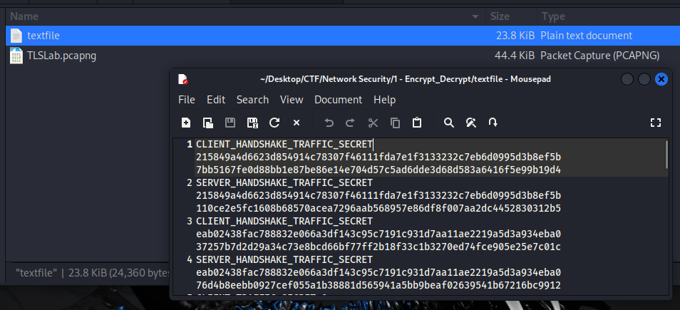
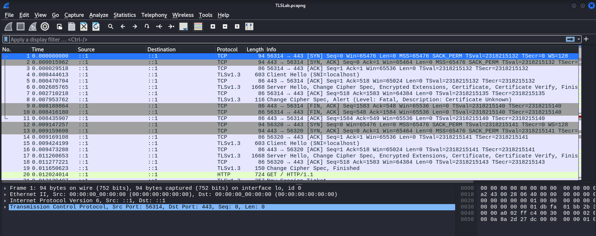
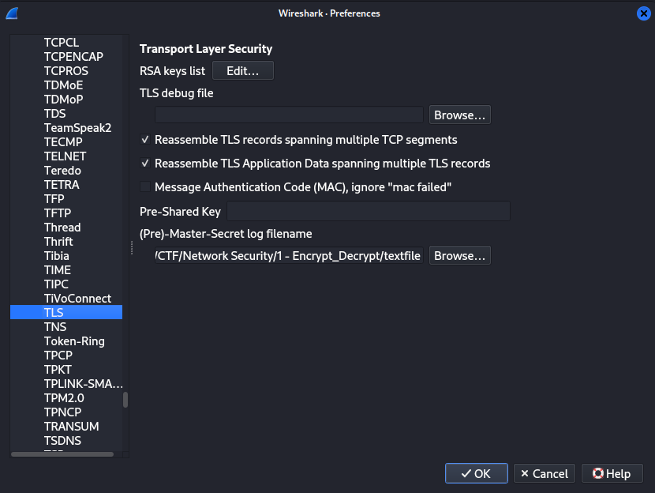
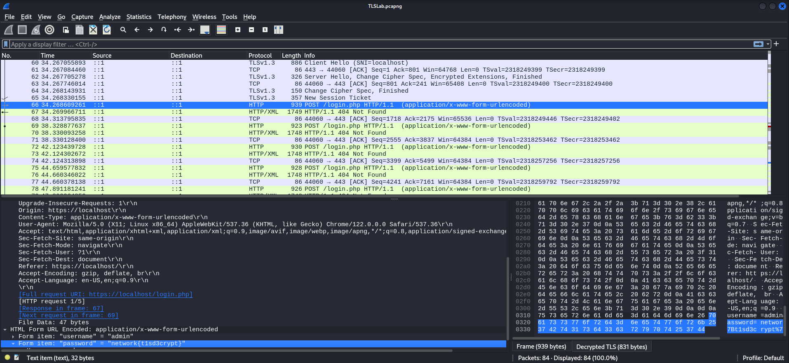

```
Can you find the hidden flag in the captured PCAP file. The flag pattern is network{[flag]}.
Password: secplayground
Format: network{...}
```

The Challenge contain 2 file.

textfile : Contain a Secret log filename

TLSLab.pcapng : Contain a TLS 1.3 traffic





I need to decrypt TLS traffic. In order to do that, I Import textfile in wireshark.

https://www.comparitech.com/net-admin/decrypt-ssl-with-wireshark/





```
network{t1sd3crypt}
```

