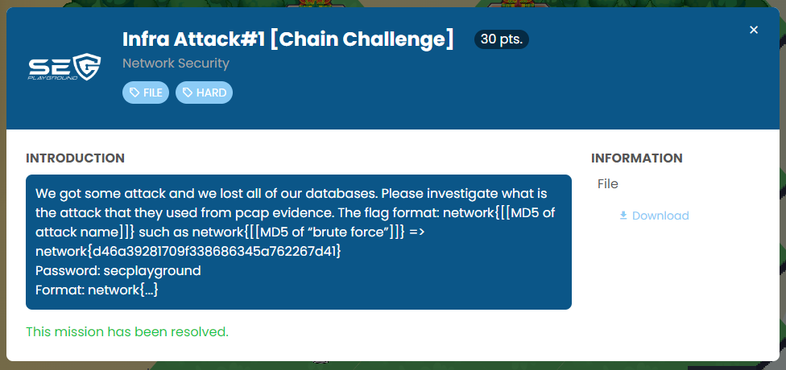

Challenge contain 1 pcap file.

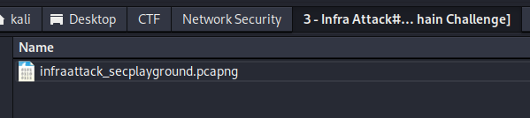

For overview of activities, I usually upload the pcap file to online pcap analyzer.

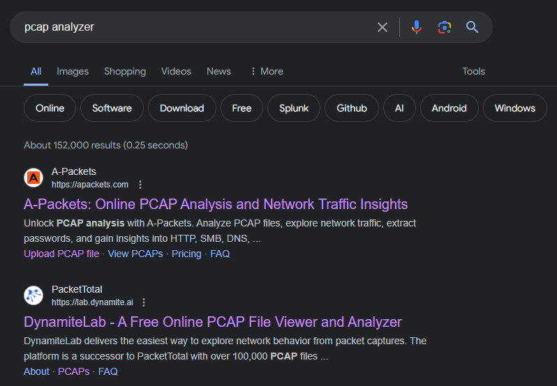

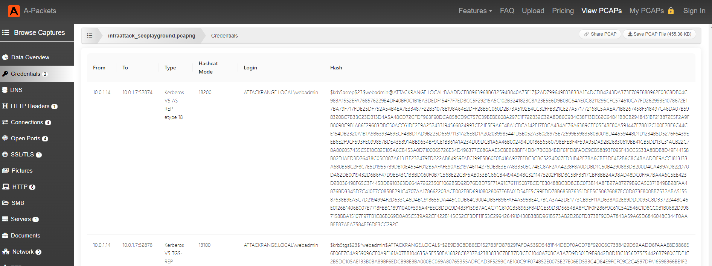

I saw the Kerberos ticket request. So I assume that malicious activities is kerberoasting or AS-REP Roasting.

Let's drill down to confirm our hypothesis.

```
kerberos or ldap
```

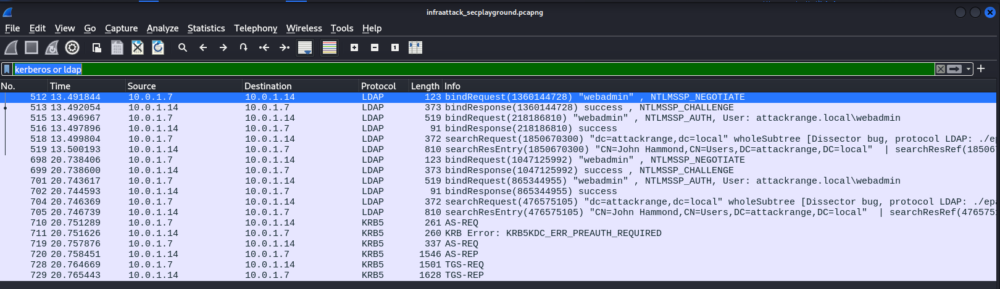

https://jsecurity101.medium.com/ioc-differences-between-kerberoasting-and-as-rep-roasting-4ae179cdf9ec

https://www.netwrix.com/cracking_kerberos_tgs_tickets_using_kerberoasting.html

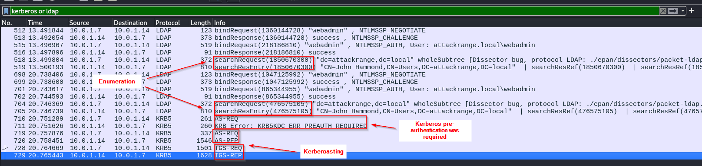

TGS-Ticket request

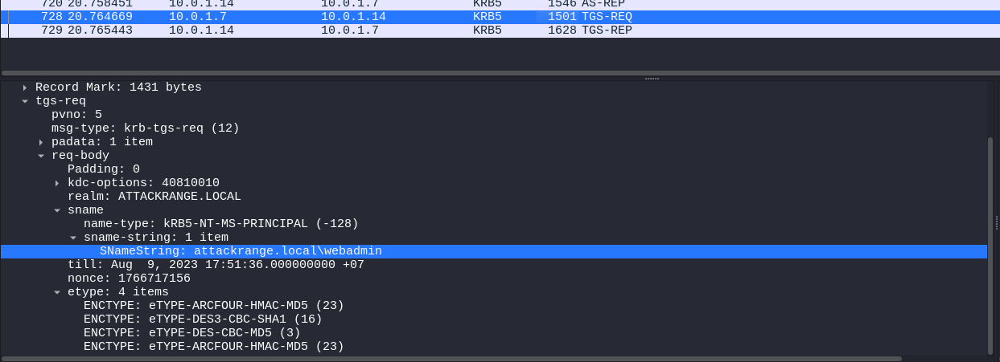

TGS-Ticket granted

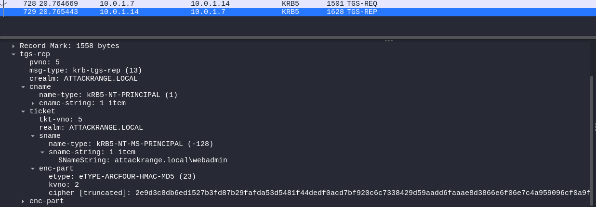

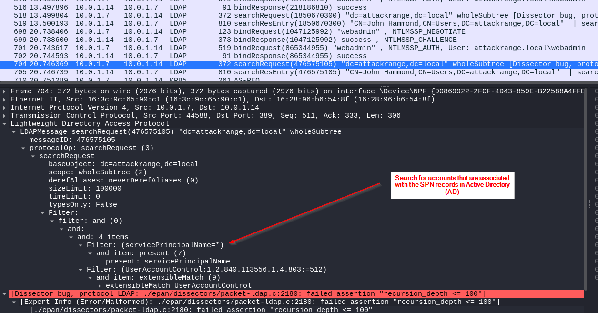

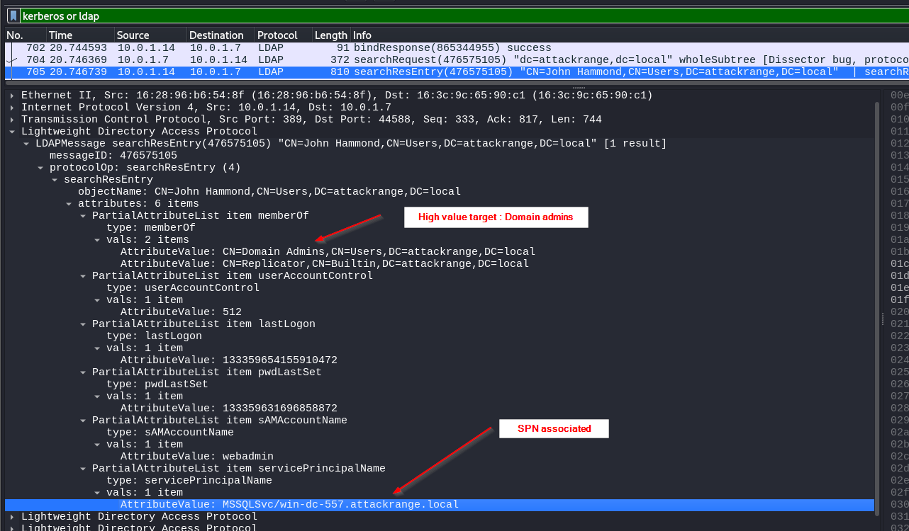

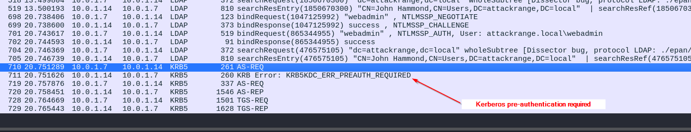

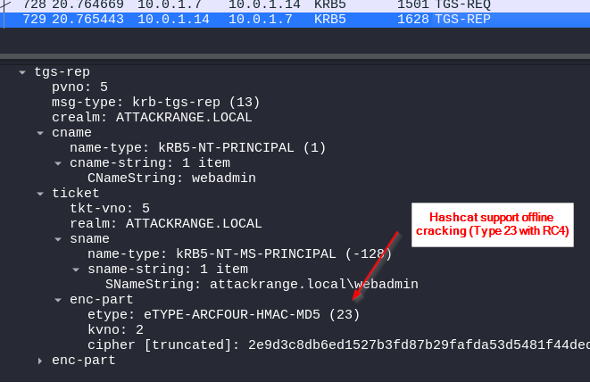

Let's breakdown what I gain from analysis.

1.Attacker trying to enumeration on DC server to find account associated with SPN record.

2.This is not AS-REP Roasting attack. Because Kerberos pre-authentication was required. And there should be a TGT-REQ/TGT-REP.

3.It's likely to be Kerberoasting attack, because DC server is authorizing the user through AS-REQ/AS-REP, then sending service ticket that was requested TGS-REQ/TGS-REP.

4.There was a Kerberos V5 TGS-REP etype 23 which known to  offline brute force attack with hashcat.

| Kerberoasting                                                | AS-REP Roasting                                              | PCAP file                                                    |
| ------------------------------------------------------------ | ------------------------------------------------------------ | ------------------------------------------------------------ |
| Attacker trying to find account associated with Service Principal Names (SPN) | Same with Kerberoasting.                                     | Attacker trying to find account associated with Service Principal Names (SPN) |
| AS-REQ/AS-REP Then TGS-REQ/TGS-REP                           | Only AS-REQ/AS-REP, Requests a Kerberos Authentication Ticket (TGT) | AS-REQ/AS-REP Then TGS-REQ/TGS-REP. There is no TGT-REQ/TGT-REP |
| -                                                            | Do not require Kerberos pre-authentication                   | Require Kerberos pre-authentication                          |
| Kerberos V5 TGS-REP etype 23                                 | Kerberos V5 AS-REP etype 18                                  | Have both                                                    |


```
network{kerberoasting}
```

