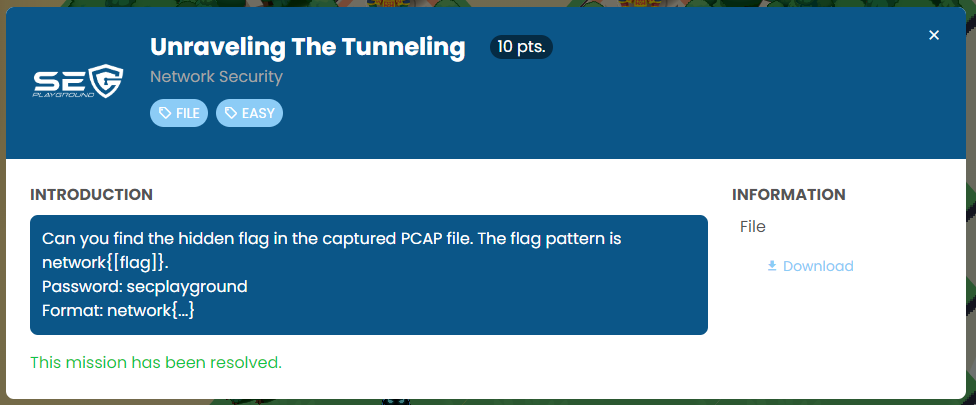
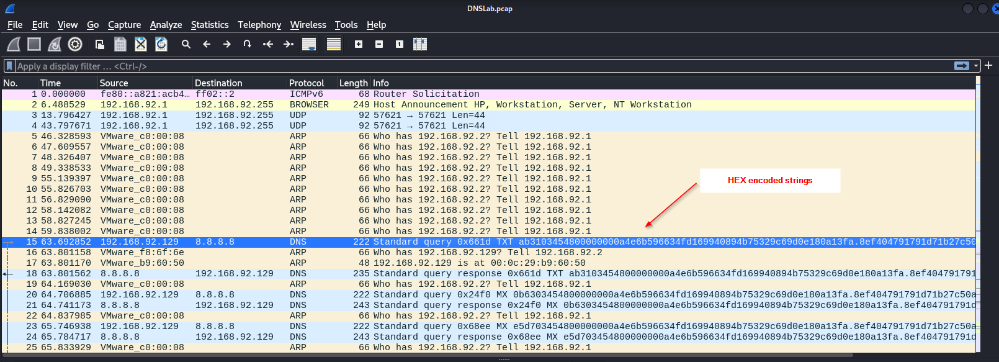
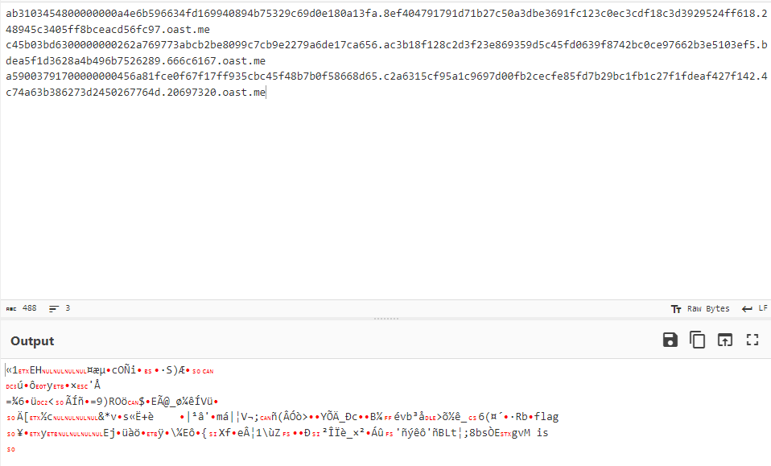
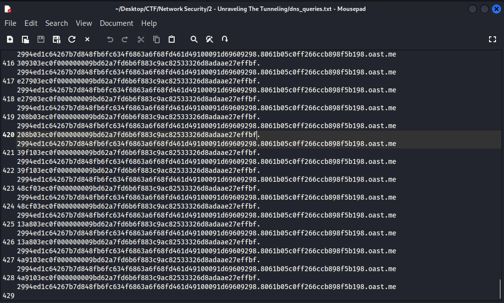
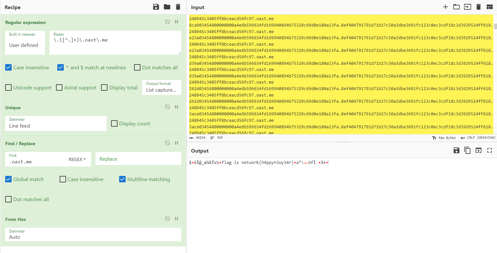
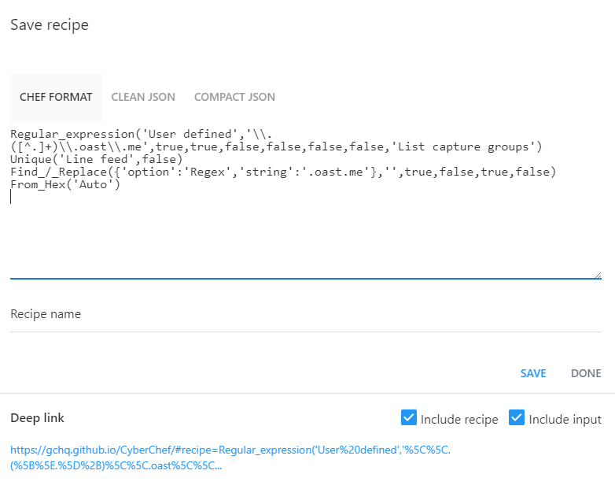

```
Can you find the hidden flag in the captured PCAP file. The flag pattern is network{[flag]}.
Password: secplayground
Format: network{...}
```

Challenge contain pcap file that likely to be DNS tunneling.



I tried grep some sample of it and decode.



Look like that a flag hidden. Let's extract DNS query from pcap file with wireshark.

```
tshark -r DNSLab.pcap -Y "dns" -T fields -e dns.qry.name > dns_queries.txt
```



I'm using Cyberchef to do the following.

1.Select only sub domain part before "".oast.me"

2.Remove duplication of result.

3.Remove .oast.me text

4.Decode from Hex.





```
Regular_expression('User defined','\\.([^.]+)\\.oast\\.me',true,true,false,false,false,false,'List capture groups')
Unique('Line feed',false)
Find_/_Replace({'option':'Regex','string':'.oast.me'},'',true,false,true,false)
From_Hex('Auto')
```


