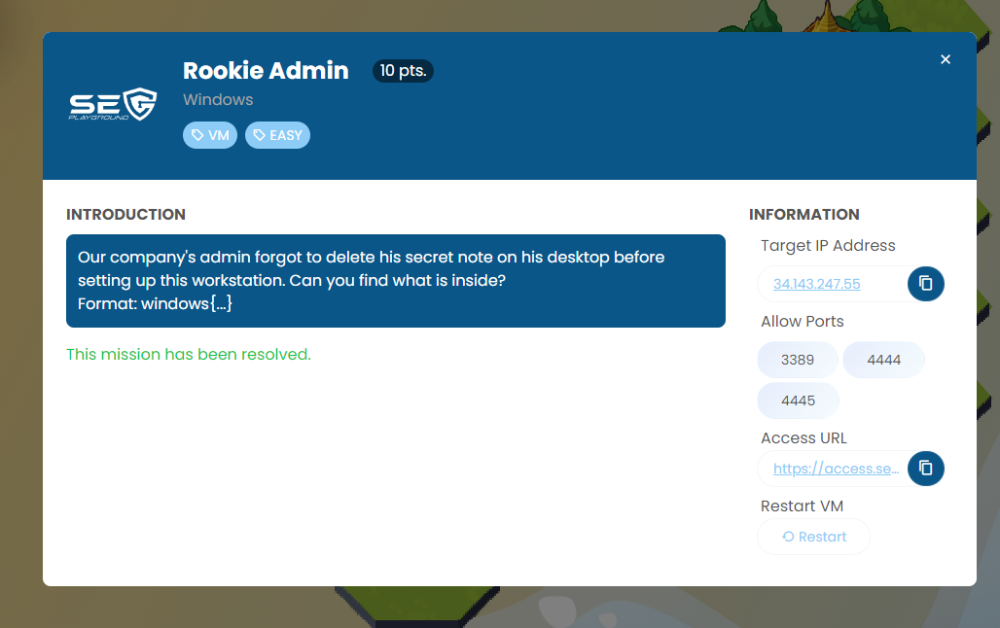
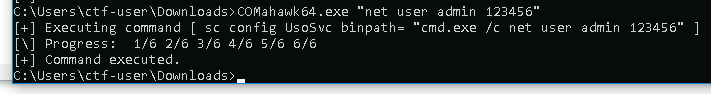

Challenge was a old windows machine that was vulnerable to a lot of exploit. The machine has a internet access too.

After I enumeration with winPEAS, I found that machine was vulnerable to COMahawk vulnerability.

https://github.com/peass-ng/PEASS-ng/tree/master/winPEAS

https://github.com/apt69/COMahawk

I'm using exploit to execute command in administrator context. Then open file as "admin" user.



```
windows{MCCGlHbxX5}
```

